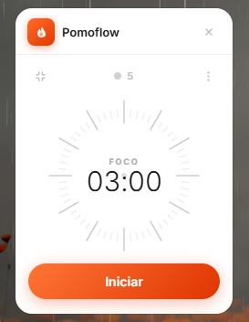
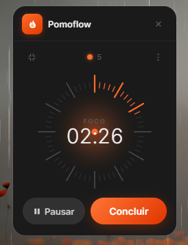
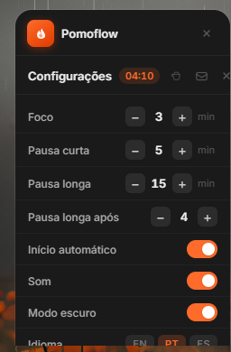
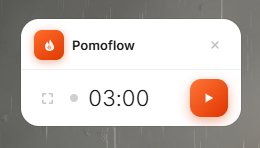
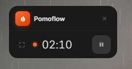

<div align="center">
  
  <h1>Pomoflow</h1>
  <p>A beautiful, minimal Pomodoro timer widget for Windows</p>

  
  
  
  

  <br/>

  
  &nbsp;&nbsp;
  
  &nbsp;&nbsp;
  

  <br/><br/>

  
  &nbsp;&nbsp;
  
</div>

---

## 🇧🇷 Português

### O que é o Pomoflow?

Pomoflow é um widget de timer Pomodoro minimalista para Windows, construído com Tauri e React. Ele flutua sobre suas janelas, suporta tema claro e escuro, modo mini, e é totalmente personalizável.

### Funcionalidades

- ⏱ Timer Pomodoro com foco, pausa curta e pausa longa
- 🌙 Tema claro e escuro
- 📦 Modo mini compacto
- 🔔 Som ao finalizar sessão
- 🔁 Início automático entre sessões
- 💾 Contagem de sessões do dia (salva no localStorage)
- 🌍 Suporte a 3 idiomas: Português, Inglês e Espanhol
- ⚙️ Durações personalizáveis

### Instalação

1. Baixe o instalador mais recente na [página de releases](https://github.com/corazzione/pomoflow-app/releases)
2. Execute `Pomoflow_x.x.x_x64-setup.exe`
3. O app será instalado e estará disponível no menu Iniciar

### Desenvolvimento local

**Pré-requisitos:** Node.js 18+, Rust, Tauri CLI

```bash
git clone https://github.com/corazzione/pomoflow-app.git
cd pomoflow-app
npm install
npm run tauri dev
```

**Build para produção:**
```bash
npx tauri build
```
Os instaladores estarão em `src-tauri/target/release/bundle/`.

### Stack

- [Tauri v2](https://tauri.app) — runtime nativo leve para Windows
- [React 19](https://react.dev) — interface
- [Vite 8](https://vite.dev) — bundler

### Apoie o projeto

Se o Pomoflow te ajudou a ser mais produtivo, considere um café:
[☕ Buy me a coffee](https://buymeacoffee.com/corazzione)

---

## 🇺🇸 English

### What is Pomoflow?

Pomoflow is a minimal Pomodoro timer widget for Windows, built with Tauri and React. It floats above your windows, supports light and dark themes, a compact mini mode, and is fully customizable.

### Features

- ⏱ Pomodoro timer with focus, short break, and long break
- 🌙 Light and dark theme
- 📦 Compact mini mode
- 🔔 Sound when session ends
- 🔁 Auto-start between sessions
- 💾 Daily session count (saved in localStorage)
- 🌍 3-language support: Portuguese, English, and Spanish
- ⚙️ Customizable durations

### Installation

1. Download the latest installer from the [releases page](https://github.com/corazzione/pomoflow-app/releases)
2. Run `Pomoflow_x.x.x_x64-setup.exe`
3. The app will be installed and available in the Start menu

### Local development

**Prerequisites:** Node.js 18+, Rust, Tauri CLI

```bash
git clone https://github.com/corazzione/pomoflow-app.git
cd pomoflow-app
npm install
npm run tauri dev
```

**Production build:**
```bash
npx tauri build
```
Installers will be at `src-tauri/target/release/bundle/`.

### Stack

- [Tauri v2](https://tauri.app) — lightweight native runtime for Windows
- [React 19](https://react.dev) — UI
- [Vite 8](https://vite.dev) — bundler

### Support the project

If Pomoflow helped you stay productive, consider buying a coffee:
[☕ Buy me a coffee](https://buymeacoffee.com/corazzione)

---

## 🇪🇸 Español

### ¿Qué es Pomoflow?

Pomoflow es un widget de temporizador Pomodoro minimalista para Windows, construido con Tauri y React. Flota sobre tus ventanas, soporta temas claro y oscuro, modo mini compacto y es totalmente personalizable.

### Funcionalidades

- ⏱ Temporizador Pomodoro con foco, descanso corto y descanso largo
- 🌙 Tema claro y oscuro
- 📦 Modo mini compacto
- 🔔 Sonido al finalizar la sesión
- 🔁 Inicio automático entre sesiones
- 💾 Contador de sesiones del día (guardado en localStorage)
- 🌍 Soporte para 3 idiomas: Portugués, Inglés y Español
- ⚙️ Duraciones personalizables

### Instalación

1. Descarga el instalador más reciente en la [página de releases](https://github.com/corazzione/pomoflow-app/releases)
2. Ejecuta `Pomoflow_x.x.x_x64-setup.exe`
3. La app se instalará y estará disponible en el menú Inicio

### Desarrollo local

**Requisitos previos:** Node.js 18+, Rust, Tauri CLI

```bash
git clone https://github.com/corazzione/pomoflow-app.git
cd pomoflow-app
npm install
npm run tauri dev
```

**Build de producción:**
```bash
npx tauri build
```
Los instaladores estarán en `src-tauri/target/release/bundle/`.

### Stack

- [Tauri v2](https://tauri.app) — runtime nativo ligero para Windows
- [React 19](https://react.dev) — interfaz
- [Vite 8](https://vite.dev) — bundler

### Apoya el proyecto

Si Pomoflow te ayudó a ser más productivo, considera un café:
[☕ Buy me a coffee](https://buymeacoffee.com/corazzione)

---

## License / Licença / Licencia

MIT © [Markus Corazzione](https://github.com/corazzione)
